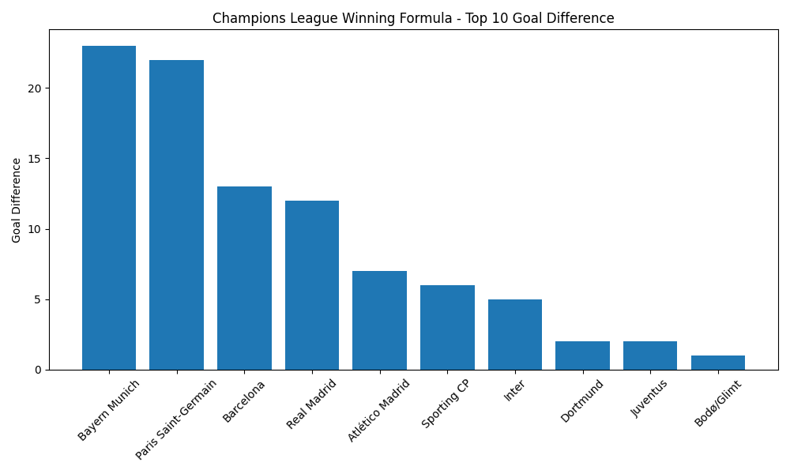
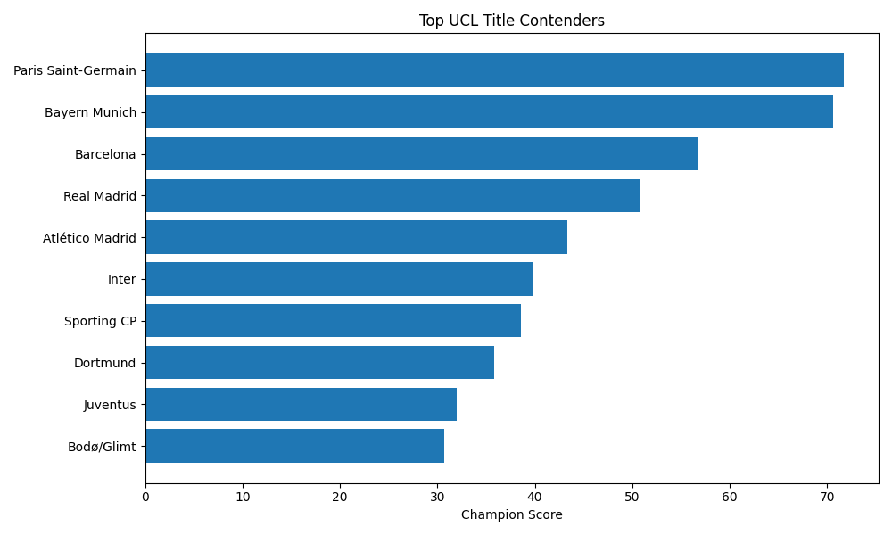

# UCL Winning Formula

> A data-driven analysis: which statistical indicators best predict success in the UEFA Champions League?

## Quick Start

```bash
pip install -r requirements.txt
jupyter notebook notebooks/ucl_analysis.ipynb
```

## Live Demo
## Live Demo

[](https://champions-league-winning-formula-uw7ckstxi7qj4ecrlmboc8.streamlit.app/)

## Dataset

Squad-level statistics from the 2024-25 UEFA Champions League, sourced from FBref:

- **Attack data** (`data/ucl_squad_stats.csv`): Goals scored, possession, age, minutes played per team.
- **Defense data** (`data/ucl_opponent_stats.csv.txt`): Goals conceded per team from the opponent's perspective.
- **Combined data** (`data/combined_ucl_data.csv`): Pre-merged table with both attack and defense stats side by side.

## Methodology

We define a weighted scoring formula:

\[
\text{WinningScore} = w_1 \times \text{GF} - w_2 \times \text{GA} + w_3 \times \text{GD}
\]

Three candidate weight sets are tested:
- **Balanced:** GF=0.4, GA=0.4, GD=0.2
- **Attack-heavy:** GF=0.5, GA=0.3, GD=0.2
- **Defence-first:** GF=0.3, GA=0.5, GD=0.2

Each model's top 8 teams are compared against the actual UCL 2024-25 Round of 16 qualifiers to find the most predictive formula.

## Key Results

**Top 10 teams by Winning Score (Balanced Model):**

| Team | GF | GA | GD | WinningScore |
|------|-----|-----|-----|------|
| Bayern Munich | 42 | 19 | +23 | 13.8 |
| Paris Saint-Germain | 45 | 23 | +22 | 13.2 |
| Barcelona | 31 | 18 | +13 | 7.8 |
| Real Madrid | 32 | 20 | +12 | 7.2 |
| Atlético Madrid | 34 | 27 | +7 | 4.2 |
| Sporting CP | 21 | 15 | +6 | 3.6 |
| Inter | 17 | 12 | +5 | 3.0 |
| Dortmund | 22 | 20 | +2 | 1.2 |
| Juventus | 19 | 17 | +2 | 1.2 |
| Bodø/Glimt | 22 | 21 | +1 | 0.6 |





## Notebook

The full analysis process is documented in [`notebooks/ucl_analysis.ipynb`](notebooks/ucl_analysis.ipynb).

## Project Structure

```
├── notebooks/
│   └── ucl_analysis.ipynb    # Main analysis notebook
├── src/                       # Core analysis scripts
│   ├── analysis.py
│   ├── champion_formula.py
│   ├── champion_formula_v2.py
│   ├── correlation.py
│   ├── goal_difference.py
│   ├── merge_data.py
│   ├── predictor_v3.py
│   ├── scatter_plot.py
│   └── visualize.py
├── data/                      # Raw and processed data
├── charts/                    # Visualization outputs
├── results/                   # Model outputs
├── requirements.txt
└── README.md
```

## Related Projects

- [World Cup 2026 Simulator](https://github.com/oceanlsq-hub/worldcup-simulator) — Monte Carlo tournament simulation with Streamlit

## License

MIT

## Blog

Read the full analysis on Medium: [What Makes a Champions League Winner? A Data-Driven Analysis](https://medium.com/@linsq0529/what-makes-a-champions-league-winner-304d8d7f4486)
